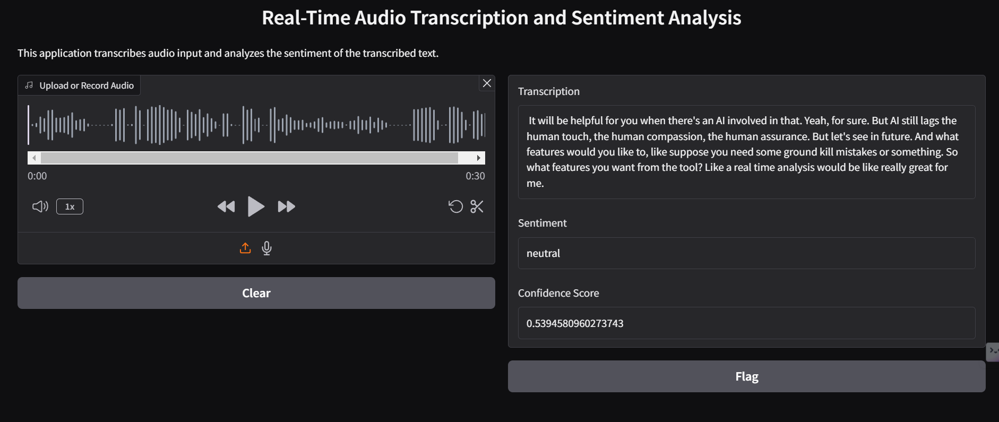

# 🏃 AI Voice Intelligence


**AI-Driven Voice Intelligence for Sales and Customer Support**

This application uses OpenAI's Whisper model for **real-time automatic speech recognition (ASR)** and CardiffNLP's Twitter-RoBERTa model for **sentiment analysis**. It allows users to **upload or record audio**, transcribes it to text, and **analyzes sentiment automatically**.

🔗 **[Live Demo](https://huggingface.co/spaces/Sumit404/ai-voice-intelligence)**

## 📸 Screenshot



## 🚀 Features
✅ **Audio Transcription:** Converts speech into text using OpenAI's Whisper.  
✅ **Sentiment Analysis:** Determines if the speech is positive, negative, or neutral.  
✅ **Multiple Audio Sources:** Supports both microphone recording and file uploads.  
✅ **Fast & Automatic:** Just **record or upload audio**—the app does the rest!  
✅ **30-Second Processing:** The app works best with short clips of up to **30 seconds**.

title: Ai Voice Intelligence
emoji: 🏃
colorFrom: green
colorTo: red
sdk: gradio
sdk_version: 5.17.1
app_file: app.py
pinned: false
short_description: 'AI-Driven Voice Intelligence for Sales and Customer Support

## 🛠️ Installation
To run this application locally, install the required dependencies:

```bash
pip install -r requirements.txt
